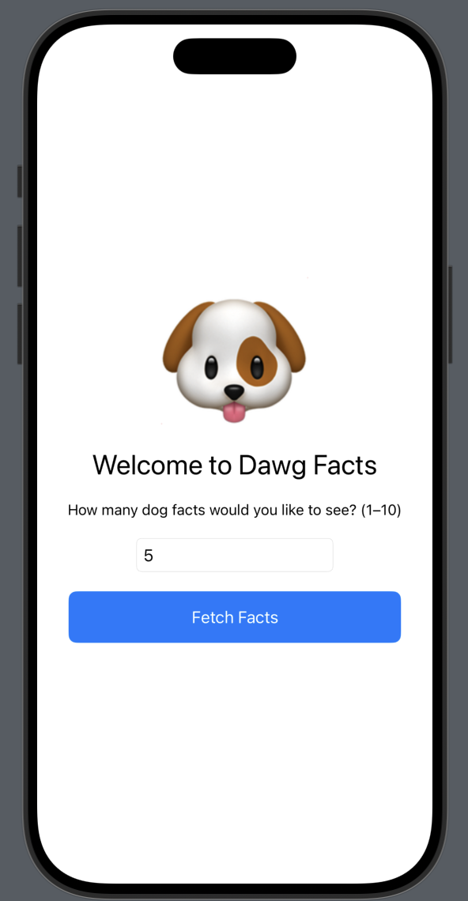
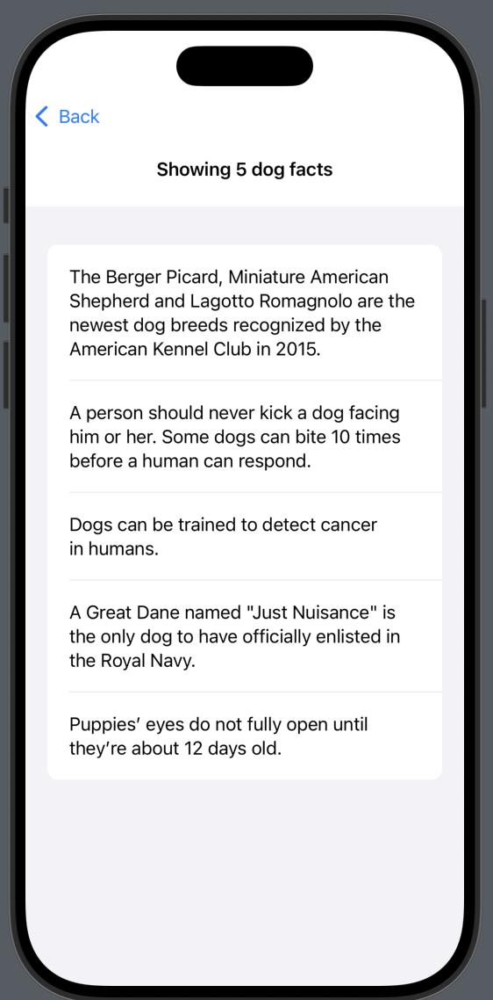

# Dawg Facts

Dawg Facts is a simple iOS app built with SwiftUI that fetches fun facts about dogs using the [Dog API by Kinduff](https://dogapi.dog). Users can input how many dog facts they want to see (up to 10) and get them instantly!

---

## Demo

---

| Home Screen                         | Dog Facts List                     |
|------------------------------------|------------------------------------|
|   | |
---

## Description

- **Title:** Dawg Facts  
- **Purpose:** Teach users cool dog facts using an intuitive UI and clean API integration.  
- **Tools Used:**
  - SwiftUI
  - Dog API (https://dogapi.dog)

---

## Features

- User input (TextField) to request 1–10 dog facts
- Real-time fetch using `@Binding` and `@ObservedObject`
- Dog image displayed at the top of the home screen
- Graceful input validation (disables button with a warning for invalid input)
- Clean navigation using `NavigationStack`

---

## Challenges + Future Plans

### Obstacles
- The Dog API sometimes returns fewer facts than requested
- Had to work around deprecated `.onChange()` modifiers
- Managing `@Binding` and `@State` correctly through navigation took tweaking

### Future Additions
- Add breed information or group filtering
- Favorite facts or share functionality
- Custom animations or transitions
- Dark mode support

---

## How to Run

1. Clone the repo
2. Open `dawg-facts.xcodeproj` in Xcode 15+
3. Run on simulator or device
4. Enjoy some 🐶 wisdom

